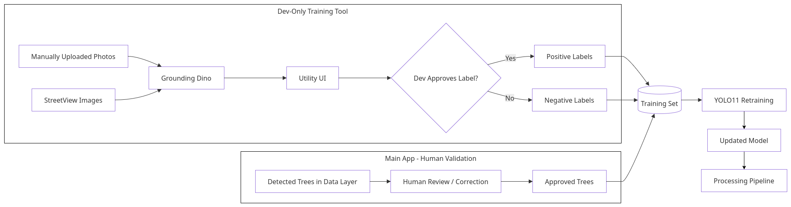

import PresentationViewer from '~/components/PresentationViewer.astro';

<PresentationViewer src="/documentation-website/presentations/ms1.pdf" title="MS1" />

---

## 1. Context
Urban trees influence temperature, air quality, water drainage, and the well-being of city residents. For this reason, Law No. 59/2021 mandates that municipalities maintain an inventory of urban trees. In practice, this inventory is compiled in the field tree by tree by teams that traverse the streets to record each individual specimen.

At the same time, a vast amount of street-level imagery is now available, and object detection models have reached a level of maturity that did not exist just a few years ago. TreeLens aims to combine these elements: it is a web application that uses Street View images and street-level videos to detect, locate, and map every tree in the city.

## 2. Problem
Manual surveying is slow, expensive, and quickly becomes outdated. By the time a zone is finished, trees have already been planted, cut down, or become diseased. The information often resides on paper forms or spreadsheets lacking reliable georeferencing making it difficult to compare data across years or share it between departments.

Automating the process presents its own set of challenges:
- Duplicates: the same tree appears in multiple images and cannot be counted more than once.
- Location: the tree's position must be estimated from the images, rather than simply being that of the car or camera.
- Capture conditions: occlusions, shadows, seasons, and varying lighting.
- GDPR: street-level images contain faces and license plates.
- Model errors: these can only be corrected through human validation, and that validation must improve the model rather than being wasted.

The central question is how to obtain a georeferenced, duplicate-free, and updatable inventory at a cost significantly lower than that of a manual survey, without compromising confidence in data quality.

## 3. Goals
The overall objective is to reduce the effort involved in creating and maintaining the urban tree inventory, while upholding a level of quality that technicians can validate. Specifically, the project aims to:
- detect trees in street-level images and video and estimate their geographic position;
- build and maintain a georeferenced inventory, without duplicating the same tree seen in multiple images;
- close the learning loop, so that corrections made on the platform feed into the model's retraining;
- validate in a pilot zone against a manual survey, using precision, recall, and localization error.

As extensions, the project aims to characterize each tree (species or genus, size, signs of poor condition) and provide statistics by street or district, as well as comparisons between surveys.

During the first half of the year, the focus is on defining the architecture, getting the core pipeline operational, and validating the system in terms of performance, scalability, security, and model quality.

## 4. Important tasks for comprehensive development
- **Analysis pipeline:** image collection from an area and video processing involving GPS, face and license plate blurring, tree detection, position estimation via triangulation between views, and fusion of repeated detections.
- **Web application:** interactive map, zone selection, video upload, tree records with source images, and manual validation and correction.
- **Data and infrastructure:** message queue for asynchronous processing, geospatial database for the inventory, NoSQL database for job status, object storage for images and videos, reverse proxy, and continuous integration.
- **Model and data:** image annotation, training, evaluation, and error analysis.
- **Management and documentation:** schedule, communication, use cases, requirements, legal and risk analysis, and presentation preparation.

## 5. Expected results
By the end of the first half of the year, we expect to have:
- the architecture and requirements documented;
- a functional end-to-end pipeline, from image upload to the tree appearing on the map;
- a detection model trained on annotated data from the pilot zone, including metrics and error analysis;
- a system validated for performance, scalability, and security.

By the end of the project, we expect to have a georeferenced inventory compared against a manual survey and a demonstration of the correction and retraining cycle. The expected value lies in reduced survey time, more frequent updates, and a database that is easier to share and compare.

## 6. Related Work
- **Current practice:** Tree inventorying is still largely manual: paper forms or Excel, later imported into systems like i-Tree Eco and Streets, which analyze and value trees but don't survey them. To cut costs, these tools often recommend sampling only a few street segments, yielding ~10% standard error in total tree counts an implicit admission that full inventories are expensive. The resulting data is poorly georeferenced and hard to update or compare over time.

- **Collaborative data collection tools:** Collaborative tools like OpenTreeMap (municipal inventories) and iNaturalist (tree identification and mapping) improve record-keeping and participation, but still depend on people visiting each tree.

The field is split in two: municipalities rely on paper, Excel, and i-Tree costly, infrequent surveys analyzed only after collection while research shows trees can be detected and located from street-level imagery, yet these methods stay confined to research pipelines instead of becoming everyday municipal tools.

## 7. High-Level Architecture
It is important to mention that this architecture is being designed prior to the start of project development, therefore, it is highly subject to modification to ensure the project's proper functioning.

#### Model's Retraining Process

